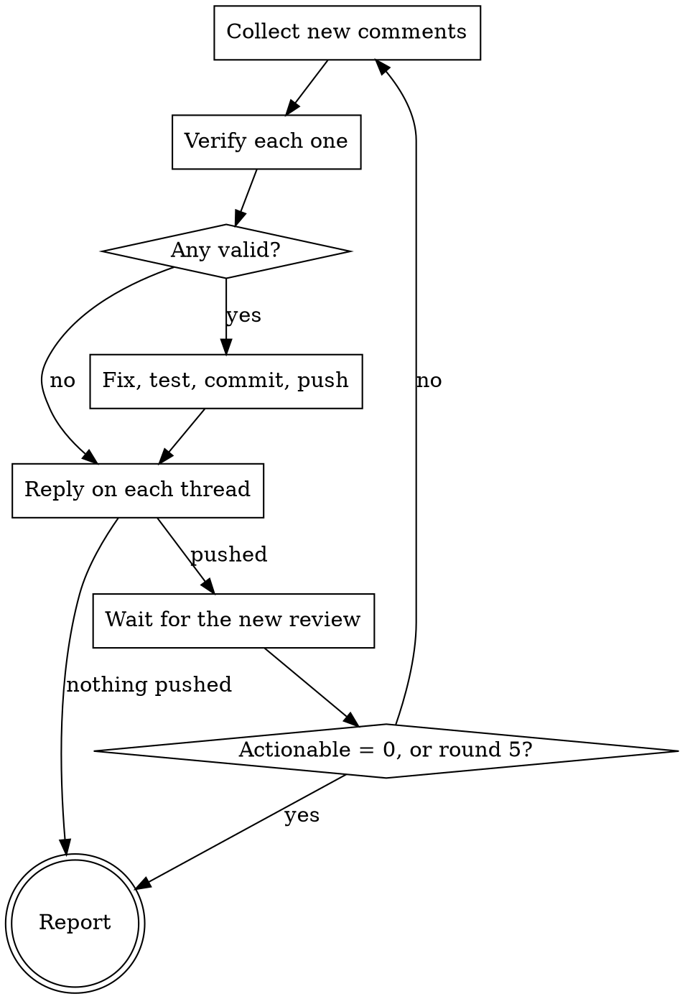

# CodeRabbit

CodeRabbit is a review bot. It finds real defects, and it also misreads code with
confidence. Treat each comment as a claim to verify, not as an order.

The bot reviews again after each push. So the work is a loop: collect, verify,
fix, push, wait for the new review, repeat. Stop when the bot has nothing
actionable left, or when the only comments left are ones you rejected.



## 1. Resolve the PR

Take the PR of the current branch:
```sh
gh pr view --json number,headRefName,url
```
If no PR: say so and stop.

Keep the owner and repo for the API calls:
```sh
gh repo view --json nameWithOwner -q .nameWithOwner
```

Starting this skill is the approval to push. Push a commit at the end of each
round without asking, in this round and in every later one.

## 2. Collect the new comments

CodeRabbit writes in three places.

In round 1, read everything. In a later round, read only what is newer than the
watermark - the UTC time you started the collection of the round before:

```sh
SINCE=1970-01-01T00:00:00Z   # round 1; later rounds: start time of the last round

# inline comments on lines of the diff
gh api "repos/$REPO/pulls/$PR/comments" --paginate \
  | jq --arg since "$SINCE" '.[] | select(.user.login == "coderabbitai[bot]")
        | select(.created_at > $since)
        | {id, path, line, body, in_reply_to_id, url: .html_url}'

# review summaries - the body holds "Actionable comments posted: N"
gh api "repos/$REPO/pulls/$PR/reviews" --paginate \
  | jq --arg since "$SINCE" '.[] | select(.user.login == "coderabbitai[bot]")
        | select(.submitted_at > $since) | {id, state, submitted_at, body}'

# top level comments on the PR
gh api "repos/$REPO/issues/$PR/comments" --paginate \
  | jq --arg since "$SINCE" '.[] | select(.user.login == "coderabbitai[bot]")
        | select(.created_at > $since) | {id, body}'
```

Write down the new watermark before you read anything.

The bot hides most of the content in collapsed `<details>` blocks: committable
suggestions, duplicate findings, nitpick lists, and "Prompt for AI agents"
sections. Expand each block and read it. A finding that is only in a `<details>`
block counts the same as one in the visible text.

Skip a thread when it is already settled:

- a reply from the human author is after the last bot message, or
- the comment is on an outdated diff and the code no longer matches, or
- you rejected the same claim in an earlier round.

Say the round number, how many comments you found, and how many you skipped.

## 3. Verify each comment

Open the file at `path:line` and read the code around it. Read the callers when the
claim is about an interface. Then give each comment one verdict:

- **valid** - the defect is real. You can state the input and the wrong result.
- **wrong** - the bot misread the code. Write the one line reason.
- **out of scope** - real, but not part of this change. Do not fix it here.

Use `superpowers:receiving-code-review` for the discipline of this step. A bot that
sounds sure is still only a reviewer.

## 4. Fix and push

Fix the valid comments, one file at a time. Keep each fix small and separate from
unrelated work.

Then run the tests of the project. No test suite: say so.

Commit and push. One commit per round is enough. Keep the sha; you need it for the
replies.

No valid comment in this round: push nothing, and go to the report. A round with no
push gets no new review.

## 5. Reply on each thread

Answer every comment of the round, valid or not:

```sh
gh api --method POST "repos/$REPO/pulls/$PR/comments/$COMMENT_ID/replies" \
  -f body="Fixed in $SHA: <what changed>."
```

For a review summary or a top level comment, reply on the PR instead:

```sh
gh pr comment "$PR" --body "..."
```

One or two sentences. What changed and the commit sha, or why you rejected the
comment. Do not resolve the threads.

## 6. Wait for the new review

The bot reviews the new commits on its own. Poll the reviews endpoint for a
CodeRabbit review submitted after your push:

```sh
gh api "repos/$REPO/pulls/$PR/reviews" --paginate \
  | jq --arg since "$PUSH_TIME" '.[] | select(.user.login == "coderabbitai[bot]")
        | select(.submitted_at > $since) | {id, submitted_at, body}'
```

Wait with the tool your harness gives you for waiting on a condition. Do not block
the shell with `sleep`. Check about every two minutes, and give up after fifteen.

No review after fifteen minutes: stop the loop and say the bot did not answer.

## 7. Stop

Stop the loop at the first of these:

- the newest review says `Actionable comments posted: 0`;
- every new comment of the round was wrong or out of scope, so you pushed nothing;
- you finished round 5;
- the wait for the new review timed out.

Never stop because the remaining comments look small. Nitpicks are comments too:
fix them or reject them with a reason.

## 8. Report

A table in chat, in this order:

| Round | Comment | Verdict | Action |
| --- | --- | --- | --- |
| 1 | `file:line` - the claim in a few words | valid | fixed in `<sha>` |

Put the rejected and out of scope comments last, each with its reason on one line,
so the human can overrule you.

End with one line: which condition stopped the loop, and what is still open.
