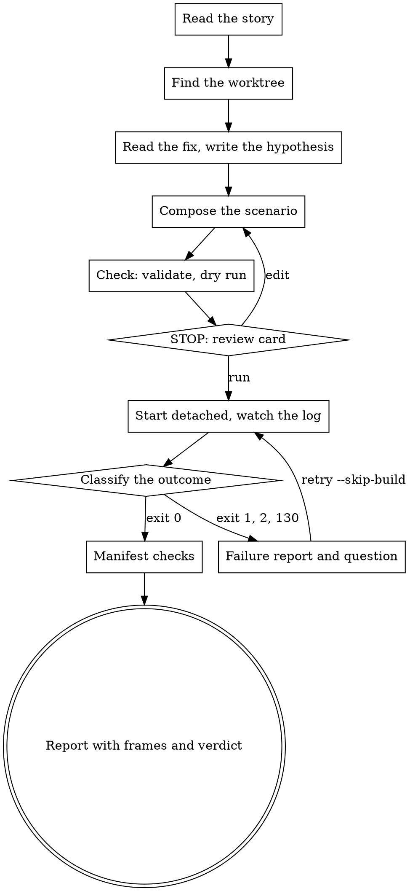

# Grid video

One story, one scenario, one mp4. The left half runs `main:latest`, the right half runs
the images built from the story's worktree, both on the lab VM, through `gridlab run`.

The workflow stops once on purpose, before the lab runs: a scenario you did not review
is a video of the wrong thing, and a run holds the one lab for up to twenty minutes.

The scenario format and the run are documented in `~/ts/tgx-deploy-dc/gridlab/README.md`;
read it once per session. This skill restates only the composition rules.



## Rules that stand

- Run from a session opened in `~/ts/main`: the Shortcut tools exist only there.
- Never destroy or recreate the VM. Never run `gridlab stack reset` without asking first.
- Never write in a worktree. Write only under `~/ts/videos/<branch dir>/`.
- `GHCR_TOKEN` stays in the environment: never print it, never pass it as a flag.
- Absolute paths in every command. `D` below is `/home/nono/ts/videos/<branch dir>`,
  where `<branch dir>` is the branch name with every `/` replaced by `-`.
- No other work while a run is in progress.

## 1. Read the story

`sc-NNNN`, a bare number, or a Shortcut URL all mean story NNNN. Load the Shortcut
tools with `ToolSearch`. Absent: stop with "open a session in ~/ts/main; the Shortcut
tools live there". Read the story with `stories-get-by-id`: title, description,
comments, linked stories. Get the branch with `stories-get-branch-name`.

Say back the bug in three lines.

## 2. Find the worktree

```sh
git -C /home/nono/ts/main worktree list --porcelain
```

Take the entry whose `branch` line is `refs/heads/<story branch>` and whose directory
exists. None: stop, and show the line that fits the branch's state:

- `git -C /home/nono/ts/main show-ref --verify --quiet refs/heads/<branch>` exits 0, the
  branch exists locally: `git -C /home/nono/ts/main worktree add /home/nono/ts/<NNNN> <branch>`.
- `git -C /home/nono/ts/main ls-remote --heads origin <branch>` prints a line, the branch
  exists on origin only: `git -C /home/nono/ts/main fetch origin <branch> &&
  git -C /home/nono/ts/main worktree add /home/nono/ts/<NNNN> <branch>`.
- Neither: "the story has no branch; the fix does not exist yet; run `story sc-NNNN` first".

Then, in the worktree `W`:

```sh
git -C W fetch origin main
git -C W merge-base origin/main HEAD          # the base
git -C W diff --quiet <base>; echo $?        # 0: the working tree equals the base
git -C W ls-files --others --exclude-standard
```

Both empty: stop, "the working tree equals the merge base: the fix is merged or not
written; both halves would be the same". A dirty tree is allowed; the card says so.

## 3. Read the fix, write the hypothesis

```sh
git -C W diff --stat <base>
git -C W diff <base> -- ':!*_test.go'
git -C W diff <base> -- '*_test.go'
```

Read the untracked files under a service directory too: the build includes them. The
test names and fixtures are the best statement of the trigger.

Write the hypothesis: one line for before, one for after, in grid terms (which robot
goes where, which tote reaches PS1, which order completes or stalls, when), each with
the evidence that can show it: an order status in the manifest, or motion in the frames.

```
before: SC-5065-ORD-2 stays INSUFFICIENT_STOCK (manifest) and no robot moves for it (frames)
after:  a robot brings tote (8,0) z6 to PS1 once ORD-1 completes (frames); ORD-2 COMPLETED (manifest)
```

Not visible on the grid: stop with `AskUserQuestion`, "show it anyway (timing only)"
or "drop it".

## 4. Compose the scenario

`mkdir -p D`, then write `D/scenario.json` with the Write tool. Rules:

- **World and fleet.** Default: the lab world and its ten robots (no `world`, no
  `agents_csv`). A subset when the trigger is one robot's behaviour or contention
  between a few (the story says one robot, wait, path, blocked, lifty):
  `gridlab world subset --agents adam,rose --out D`, then in the scenario
  `"world": {"file": "world.json", "id": "WorkBox BER2 (imported)"}` and
  `"agents_csv": "agents.csv"`. Nothing else is derived: another layout, more than ten
  robots, moved stations or totes stop with a question; the operator supplies that
  world file and CSV, and the scenario names them.
- **Totes.** From the world's `totes[]`:

  ```sh
  jq -r '.[] | select(.id=="WorkBox BER2 (imported)") | .totes[] |
    "\(.tote_id) \(.grid_coordinates.x),\(.grid_coordinates.y) z\(.grid_coordinates.z)"' \
    /home/nono/ts/tgx-deploy-dc/gridlab/lab/world_registry.json
  ```

  PS1's modules sit at (3,-1), (4,-1), (5,-1). Stacks: (4,3) z 1..8, (7,2) z 1..8,
  (8,0) z 1..6; single totes at (0,2) and (2,1). Take the highest z of a stack for a
  short trip, a lower z when digging is the point. The card lists each tote with its
  cell and level.
- **SKUs and stock.** One SKU per stock role, aliases `SC-NNNN-SKU-1`, `-2`, …, names
  that say the role ("Short stock", "Stocked"). One section per tote unless mixed totes
  matter (then 2 or 4 sections, `B`/`C` or `D`..`G`). Stock covers the orders unless a
  shortage is the trigger; then keep the validate warning and name it in the card.
- **Orders.** `SC-NNNN-ORD-1`, `-2`, …, all at `PS1`, one line unless multi-line is the
  trigger, `priority` only when ordering is the trigger, at most six orders.
- **Timing.** `operator.delay_s` 5, `settle_s` 20,
  `max_duration_s` = 2 × (90 + 30 × (total lines − 1)), rounded up to a multiple of 60,
  clamped to 180..1800. Two one-line orders give 240. An order the hypothesis keeps in
  `PENDING`, `PROCESSING` or `IN_PROGRESS` makes its side run to `max_duration_s`; one
  kept in `INSUFFICIENT_STOCK`, `MIXED` or `NEW` stops its side 35 s after its last
  change. Say which case applies in the card's wall time. Do not pad further.
- **Shapes**, guidance, not rules:

  | trigger family | shape |
  |---|---|
  | insufficient stock, skipped orders | one short SKU, one stocked SKU, two orders |
  | waves, trolleys, wave members | three orders sharing SKUs, some with two lines |
  | one robot's path, wait, blocked cell | subset of one or two robots, totes far from PS1 |
  | delivered line, re-dispatch, basket | one order with two lines from two totes |

## 5. Check

```sh
gridlab scenario validate D/scenario.json
gridlab run --dry-run --worktree W
```

A scenario error is your mistake: fix the file and check again, at most three rounds,
then stop and show the error. `FAIL` lines, `lock held`, or any other exit 2 from the
dry run: stop and show the output.

## 6. STOP: the review card

One message, then one `AskUserQuestion`: run, edit (say what), abort. An edit goes back
to step 4 and the card comes again.

```
sc-NNNN <title>
hypothesis   before: <one line>
             after:  <one line>
scenario     world WorkBox BER2 (imported), fleet <ten lab robots | subset adam, rose>
             skus   SC-NNNN-SKU-1 "Short stock" | SC-NNNN-SKU-2 "Stocked"
             totes  01J21PK99MHK163VMPXKFXSGJV (8,0) z6: A SKU-1 x4 | …
             orders SC-NNNN-ORD-1 PS1: SKU-1 x2 | SC-NNNN-ORD-2 PS1: SKU-1 x4 (short by 2, on purpose)
             timing operator 5 s, settle 20 s, max 240 s
dry run      <the dry-run block, verbatim>
files        D/scenario.json [world.json agents.csv]
wall time    recordings at most 2 × (settle + max) = <n> min (<before runs to max | stops on stall>);
             plus 5 to 20 min of builds, resets and encoding
stop line    kill -INT "$(cat /home/nono/ts/videos/run.lock)"
```

## 7. Start detached, watch the log

Right before the start, re-read `git -C W branch --show-current`, `git -C W rev-parse HEAD`
and `git -C W status --porcelain`. Any difference from the card's branch, HEAD or dirty
state: back to step 5. Then:

```sh
rm -f D/run.exit D/run.offset
cd D && setsid nohup sh -c \
  'gridlab run --worktree "$1" > run.log 2>&1; echo $? > run.exit.tmp; mv run.exit.tmp run.exit' \
  sh "W" > /dev/null 2>&1 &
```

Tell the operator: the log is `D/run.log`; the stop line is
`kill -INT "$(cat /home/nono/ts/videos/run.lock)"`.

Then one `Monitor`, `timeout_ms` 1800000, description `gridlab run sc-NNNN`:

```sh
D=/home/nono/ts/videos/<branch dir>
PAT='^== |^building |^warning:|recorded,|FAIL|refused|gridlab:|interrupted|timed out|killing|\.mp4$'
n=$(cat "$D/run.offset" 2>/dev/null || echo 0)
until [ -f "$D/run.exit" ]; do
  sleep 10; m=$(wc -l < "$D/run.log")
  [ "$m" -gt "$n" ] && sed -n "$((n+1)),${m}p" "$D/run.log" | grep -E "$PAT"; n=$m; echo "$n" > "$D/run.offset"
done
m=$(wc -l < "$D/run.log"); sed -n "$((n+1)),${m}p" "$D/run.log" | grep -E "$PAT"; echo "exit $(cat "$D/run.exit")"
```

Expiry without an `exit` line: arm it again; the offset file keeps old lines out. Do
nothing else while it runs. A retry with `--skip-build` uses the same start line with
the flag added after `run`.

## 8. Classify the outcome

Read `D/run.exit`, then the phase markers of `D/run.log` in order: `== guest binary`,
`building`, `== before side`, `before: … recorded`, `== after side`,
`after: … recorded`, the `.mp4` line.

| exit | last marker | class | action |
|---|---|---|---|
| 2 | none | refused before the lab | show the tail, stop |
| 1 | `== guest binary`, no `building` | guest binary push failed | show the tail, stop |
| 1 | `building`, no `== before side` | build failed | show the tail, stop |
| 1 | `== <side> side`, no `<side>: … recorded` | reset or guest failed | see below |
| 1 | both `recorded`, no `.mp4` line | encode failed | `gridlab encode --dir D` once |
| 130 | any | interrupted | see below |
| 0 | `.mp4` line | complete | manifest checks, then the report |

Reset or guest failed: show the manifest summary when `D/raw/<side>.json` exists and the
last 30 lines of the log, then ask: retry with `--skip-build` (images kept, about 5 min),
edit the scenario (back to step 6), stop. Encode failed: `gridlab encode --dir D` once,
then the report, or the tail when it fails again. Interrupted: report the phase reached;
a manifest with `aborted` true exists only when a recording was under way; after an
interrupted reset run `gridlab stack status` and, when a check fails, ask before
`gridlab stack reset`. `refused: another run holds …`: show its pid and stop.

**Manifest checks**, exit 0: for each side, `D/raw/<side>.json` has `aborted` false. A
side with `timed_out` true, every order `PENDING` for the whole recording and zero
confirmations is the known one-off stall: the run is inconclusive; say so, skip the
verdict, offer one retry with `--skip-build`. Any other `timed_out` or `stalled` value
is evidence for the verdict, not a failure.

## 9. Report

The mp4 is the last line of `D/run.log`.

```sh
ffprobe -v error -show_entries format=duration:stream=width,height -of csv=p=0 <mp4>
cat D/raw/before-label.txt D/raw/after-label.txt
```

Frames, under `D/frames/`:

- The divergence frame. Each side's `orders` map becomes a list of
  `(t − t_start, order, status)` sorted by time. Walk the two lists together. The first
  pair that differs in order or status, or whose times differ by more than 10 s, gives
  T = the earlier time + 3 s; a list that ends first counts as a difference at the other
  list's next event; no difference gives T = 10 s; clamp T to the duration minus 1 s.
  `ffmpeg -v error -ss <T> -i <mp4> -frames:v 1 D/frames/<mp4 base>-<T>s.png`.
- The contact sheet. `step` = max(20, ceil(duration / 12)), `rows` = ceil(duration / step):
  `ffmpeg -v error -i <mp4> -vf "fps=1/<step>,scale=1280:-1,tile=1x<rows>" -frames:v 1
  D/frames/<mp4 base>-sheet.png`.

View both with `Read`; describe each in one line per half.

```
<mp4 path>  <width>x<height>, <duration> s
labels      before main:latest | after <branch dir> <sha7>
before      <recorded> s; ORD-1 COMPLETED at 96 s; ORD-2 INSUFFICIENT_STOCK, stalled; timed out no; 1 confirmation
after       <recorded> s; ORD-1 COMPLETED at 95 s; ORD-2 COMPLETED at 158 s; timed out no; 2 confirmations
images      metascheduler gridlab/metascheduler-main:<sha12>, …
frames      D/frames/<name>-<T>s.png: <one line per half>
            D/frames/<name>-sheet.png: <one line per half>
verdict     before showed the bug: yes | no | not established — <evidence>
            after showed the fix:  yes | no | not established — <evidence>
```

An order-status observable is judged on the manifests; a motion observable on the
frames. When neither shows it, write "not established" and name the time range of the
video a human should watch. Post nothing to Shortcut or to a PR.

## Red flags

- Starting a run without the card, or after "edit" without showing the card again.
- Reading `<base>..HEAD` only: uncommitted and untracked changes are in the build.
- A hypothesis without its evidence (manifest or frames).
- Polling with `sleep` in the foreground, or a background Bash job for the run: the
  harness caps it at 10 minutes. Only the detached start and the Monitor.
- Treating exit 0 as a verdict before the manifest checks.
- A "yes" verdict on a motion observable without a frame that shows it.
- `gridlab stack reset`, `vm destroy` or `vm create` without the operator's word.
- Writing anything outside `D`.
