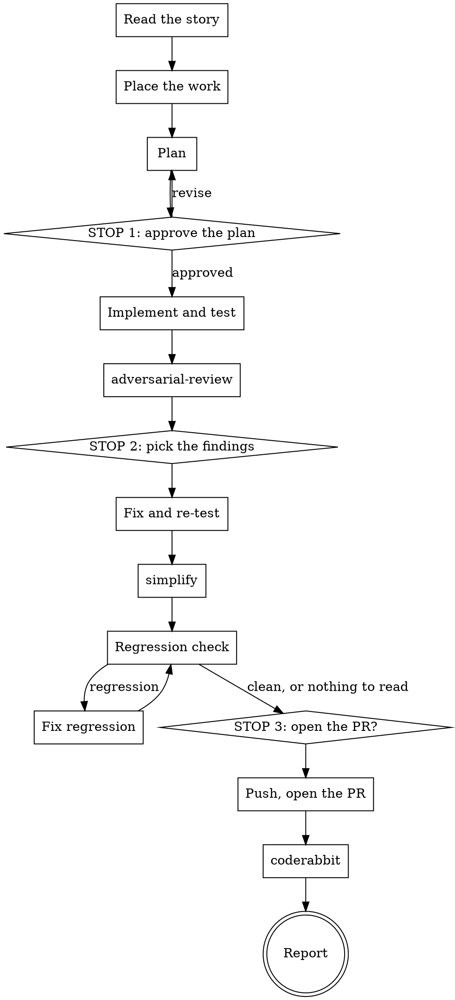

# Story

One Shortcut story, from the ticket to a pull request with a clean CodeRabbit review.

The workflow stops three times. The stops are the point of the skill: a plan you did
not approve is a plan nobody checked, and a PR opened without your word is a PR your
reviewers see before you do.



## 1. Read the story

`sc-NNNN`, a bare number, or a Shortcut URL all mean story NNNN. Load the Shortcut
tools with `ToolSearch` if they are not present, then read the story with
`stories-get-by-id`: description, comments, state, and any linked story or epic.

Say back, in three lines, what the story asks for. If the story is ambiguous enough
that two readings give different code, use `superpowers:brainstorming` before planning.

## 2. Place the work

Get the branch name from `stories-get-branch-name`. Then:

| Current state | Do |
|---|---|
| On the default branch, or the tree is dirty | New worktree |
| Already on a feature branch for this story | Stay |
| On another story's branch, tree clean | New worktree |

The worktree goes beside the other ones — the parent of the main worktree, named with
a short slug of the story, not the full branch name:

```sh
git worktree add <parent>/<slug> -b <shortcut branch name>
```

Propose the slug at STOP 1 and let it be corrected. Do the `git worktree add` only
after the plan is approved, so a rejected plan leaves no directory behind.

## 3. Plan

Read the code the story touches before writing a line of the plan. Use
`superpowers:writing-plans`. Don't forget to think about the edge cases.

The plan states: the change, file by file; what proves it works (which tests, new or
existing); and what you deliberately leave out. Name the risks you found in the code,
not generic ones.

**STOP 1.** Ask with `AskUserQuestion`: approve, revise, or change the approach. Offer
subagent-driven execution as an option when the plan's tasks are independent — then
follow `superpowers:subagent-driven-development`.

## 4. Implement and test

Follow the repo's own instructions for style, tests and line length — read its
`CLAUDE.md` and any nested one. Use `superpowers:test-driven-development` for new
behaviour.

Run the repo's checks, and the integration shards that cover the packages you touched.
Long suites go in the background, started once and waited on once — never a poll loop.

`superpowers:verification-before-completion` applies: you have not tested it until you
have read the output.

Record the SHA of the last implementation commit. Step 7 compares against it.

## 5. Review

Run the `adversarial-review` skill on the branch.

**STOP 2 is that skill's own ending** — it separates confirmed issues from nits and
asks about each in its own question. Answer both. It owns the rules; do not restate
them here, and do not replace its two questions with one.

Fix only what is chosen, and re-run the affected tests. Nits go in their own commit,
apart from the issue fixes.

## 6. Simplify

Run the `simplify` skill. It looks for reuse, simplification, efficiency and altitude
only, and it applies its own fixes — so it comes after the STOP 2 fixes, and it also
cleans them.

Read its diff before you keep it. Drop any edit that changes behaviour: that is a bug
fix, and bug fixes go through STOP 2. Re-run the affected tests. The result is its own
commit, separate from the fix commit and the nit commit.

## 7. Regression check

The fix commits and the `simplify` commit are code that no reviewer has seen. Check
them with one subagent — `Agent` with `subagent_type: general-purpose` and
`model: opus`. One agent is enough here; this is not `adversarial-review`.

First read the diff yourself:

```sh
git diff <last implementation commit>..HEAD
```

**Empty diff, no check.** Nothing was chosen at STOP 2 and `simplify` changed nothing,
so there is nothing a reviewer has not seen. Go to STOP 3.

Otherwise give the agent that diff, the files it touches, and one question: **does any
of this change behaviour that the implementation had right?** Name what it compares
against — the story, the tests, and the code before those commits.

It reports regressions only. Anything else — a new nit, a taste, a further
simplification — is out of scope and is dropped. Each regression needs a concrete
failure scenario: the inputs or state, and the wrong result that follows.

One agent means every finding is a singleton, so nothing is confirmed yet. Trace each
failure scenario in the code yourself before you touch anything. It holds: fix it,
re-run the affected tests, and run the check again on the new commit. It does not:
drop it, with a one-line reason you repeat at STOP 3.

If the same code is still flagged after two rounds, stop fixing and revert the commit
it comes from. When that is the `simplify` commit, revert it and say so at STOP 3.
When it is a STOP 2 fix, reverting undoes an approved fix — do not do that alone.
Stop and put both the regression and the fix to the human.

## 8. Open the PR

**STOP 3.** Ask before pushing. Show the commit list and the PR title you intend.

Commit and title follow the repo's conventions — for a Shortcut story that is
`[sc-NNNN] Description`, capitalised, no final period, never Conventional Commits. The
PR body states the problem, the change, and how it was verified.

Push, `gh pr create`, then run the `coderabbit` skill and work its loop to the end.

Do not run `pr-review`. Human review arrives days later, in another session.

## 9. Report

Three lines: the PR URL, what CodeRabbit changed, and anything left for the human — a
finding you dropped, a test you could not run, scope you cut.

## Red flags

- Creating the worktree before STOP 1.
- Opening the PR because the review was clean. STOP 3 is not conditional.
- Skipping a stop because the story is small, or because the last answer was "go".
- Fixing nits that no reviewer raised, in the fix commit.
- Keeping a `simplify` edit that changes behaviour.
- Running the regression check on the whole branch. It reads the fix and simplify
  commits only.
- Letting the regression check open new findings. Regressions only.
- Fixing a regression on the agent's word. One agent confirms nothing. Trace it first.
- Reverting a STOP 2 fix by yourself to make the regression check pass.
- Polling with `sleep` for CI or for CodeRabbit. Use a background command or `Monitor`.
